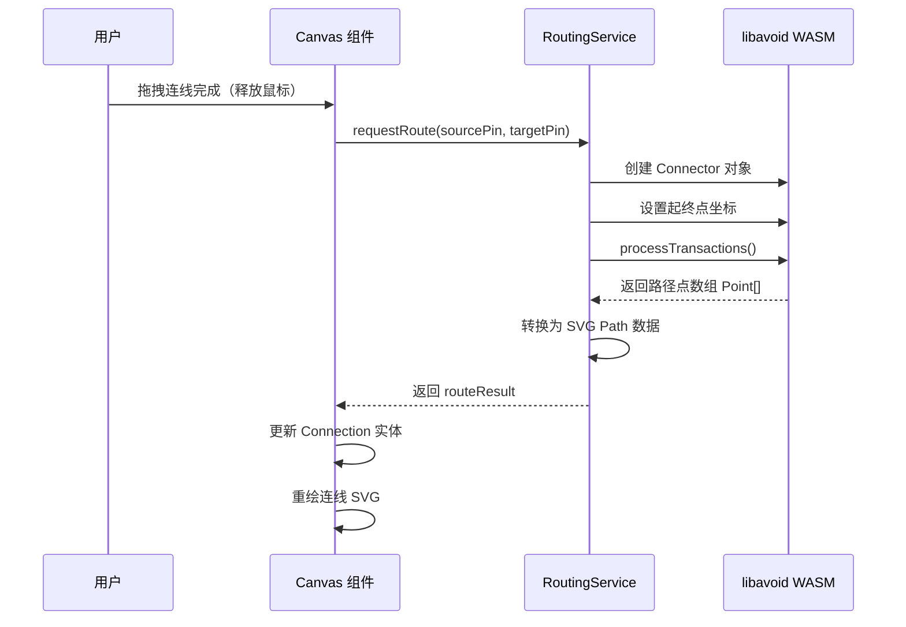

# Circuit-GUI RLC 编辑器产品需求文档 (PRD)

## 1. 产品概述

**Circuit-GUI RLC 编辑器**是一款基于 Web 的交互式电路原理图编辑器原型，专注于实现基础被动元件（电阻 R、电感 L、电容 C）的放置、连接和自动布线功能。本产品旨在验证电路编辑器核心交互流程和技术可行性，为后续全功能 EDA 工具奠定基础。

**目标用户**：电子工程师、硬件开发者、电路设计学习者、EDA 工具开发者。

**核心价值**：
- 提供直观的拖拽式电路设计体验
- 实现专业的自动布线算法（libavoid 正交路由）
- 验证五层架构在电路编辑器场景的可行性
- 为复杂电路功能扩展提供可复用的技术框架

---

## 2. 核心功能模块

### 2.1 功能范围

#### **MVP 核心功能**（本次实现）

| 模块 | 功能点 | 优先级 | 说明 |
|------|--------|--------|------|
| **器件库面板** | 左侧固定器件栏 | P0 | 展示 R/L/C 三种基础元件 |
| | 器件图标预览 | P0 | SVG 符号可视化 |
| | 拖拽源设置 | P0 | HTML5 Drag & Drop API |
| **画布编辑器** | 无限画布 | P0 | 支持平移、缩放 |
| | 器件放置 | P0 | 从左侧拖入并实例化 |
| | 器件选择与移动 | P0 | 鼠标点击和拖拽移动 |
| | 网格吸附 | P0 | 对齐到网格（默认 10px） |
| **连线系统** | 引脚可见性 | P0 | 显示元件连接端点 |
| | 手动连线 | P0 | 从引脚拖拽创建连线 |
| | 自动吸附 | P0 | 连线端点自动吸附到最近引脚 |
| | libavoid 路由 | P0 | 正交自动布线算法 |
| | 连线路径渲染 | P0 | SVG path 可视化 |

#### **扩展功能**（后续迭代）

- 元件属性编辑（阻值、容值、感值）
- 元件旋转（0°/90°/180°/270°）
- 撤销/重做
- 复制/粘贴
- 导出（PNG/SVG/JSON）
- 键盘快捷键
- 多选和框选
- 缩略图导航

---

### 2.2 用户角色

| 角色 | 描述 | 权限范围 |
|------|------|----------|
| **设计师** | 主要使用者，进行电路原理图绘制 | 所有编辑操作 |
| **观察者** | 仅查看已完成的电路图 | 只读模式（预留） |

---

## 3. 核心业务流程

### 3.1 主流程：器件放置与连线

```
┌─────────────┐    ┌──────────────┐    ┌─────────────────┐
│  打开编辑器   │───►│  从左侧拖拽   │───►│  在画布上释放    │
│             │    │  R/L/C 器件   │    │  创建器件实例    │
└─────────────┘    └──────────────┘    └────────┬────────┘
                                                │
                    ┌─────────────────────────────┘
                    ▼
           ┌─────────────────┐
           │  自动对齐网格     │
           │  显示连接引脚     │
           └────────┬────────┘
                    │
        ┌───────────┼───────────┐
        ▼                       ▼
┌──────────────┐        ┌──────────────┐
│ 继续添加器件  │        │ 开始连线操作   │
└──────────────┘        └──────┬───────┘
                               │
              ┌────────────────┼────────────────┐
              ▼                ▼                  ▼
      ┌──────────────┐ ┌──────────────┐  ┌──────────────┐
      │ 点击源引脚    │ │ 拖拽到目标    │ │ 释放鼠标      │
      │ 高亮显示      │ │ 引脚附近      │ │  自动吸附     │
      └──────────────┘ └──────────────┘  └──────┬───────┘
                                               │
                                               ▼
                                      ┌─────────────────┐
                                      │  调用 libavoid   │
                                      │  计算最优路径     │
                                      │  渲染正交连线     │
                                      └─────────────────┘
```

### 3.2 子流程：libavoid 自动布线



---

## 4. 用户界面设计

### 4.1 整体布局

```
┌─────────────────────────────────────────────────────────────────┐
│                        Toolbar (顶部工具栏)                      │
│  [选择] [放置] [连线] [撤销] [重做] [删除] [缩放控制]            │
├────────────┬────────────────────────────────────────────────────┤
│            │                                                    │
│  Device   │                 Canvas (画布区域)                   │
│  Palette  │                                                    │
│  (器件面板) │         ┌─────────────────────────┐               │
│            │         │                         │               │
│  ┌──────┐ │         │   ┌───┐    ┌───┐        │               │
│  │  R   │ │         │   │ R │────│ C │        │               │
│  │ 电阻  │ │         │   └───┘    └───┘        │               │
│  ├──────┤ │         │                         │               │
│  │  L   │ │         │          ┌───┐          │               │
│  │ 电感  │ │         │          │ L │          │               │
│  ├──────┤ │         │          └───┘          │               │
│  │  C   │ │         │                         │               │
│  │ 电容  │ │         │    (网格背景 + 无限画布)  │               │
│  └──────┘ │         │                         │               │
│            │         └─────────────────────────┘               │
│  [分类筛选] │                                                    │
│  [搜索]   │                                                    │
├────────────┴────────────────────────────────────────────────────┤
│                     StatusBar (底部状态栏)                       │
│  工具: 选择 | 坐标: (120, 85) | 缩放: 100% | 器件数: 3         │
└─────────────────────────────────────────────────────────────────┘
```

### 4.2 设计风格

**视觉风格定位**：**工业技术风 (Industrial Technical)**

- **主色调**：
  - 背景：深灰色系 `#1a1a1a` (画布) / `#2a2a2a` (面板)
  - 强调色：电子蓝 `#00d4ff` (选中/高亮) / 橙色 `#ff9500` (警告)
  - 文字：浅灰 `#e0e0e0` (主文字) / `#a0a0a0` (次要)

- **器件符号风格**：
  - 采用标准 IEEE/IEC 电路符号
  - 线宽：2px（常规）/ 3px（选中状态）
  - 颜色：白色线条 (`#ffffff`)，填充透明

- **连线样式**：
  - 默认：蓝色实线 (`#4a90d9`)，线宽 2px
  - 选中：橙色 (`#ff9500`)，线宽 3px
  - 悬停：浅蓝 (`#7ab8e5`)，显示引脚高亮

- **字体系统**：
  - 标题/标签：`JetBrains Mono` 或 `Fira Code`（等宽字体，技术感）
  - UI 文字：`Inter` 或系统默认 Sans-serif
  - 代码/数值：等宽字体

- **交互反馈**：
  - 拖拽时：半透明预览（opacity 0.7）
  - 吸附时：引脚放大 1.5x + 发光效果（box-shadow）
  - 连线中：实时预览路径（虚线动画）

### 4.3 响应式策略

- **桌面优先**（最小分辨率 1280x768）
- 左侧面板宽度：200px（可折叠至 48px 图标模式）
- 画布区域：自适应剩余空间
- 工具栏高度：48px
- 状态栏高度：28px

### 4.4 关键 UI 组件规格

#### **DevicePaletteItem（器件项）**

```
尺寸: 160px × 80px
布局:
┌─────────────────────┐
│                     │
│    [SVG Symbol]     │  ← 居中显示，60×40px
│                     │
│       电阻 (R)      │  ← 名称 + 快捷键提示
│                     │
└─────────────────────┘

交互状态:
- 默认: bg-gray-800, border-gray-700
- 悬停: bg-gray-750, border-blue-500, cursor-grab
- 拖拽中: opacity-70, cursor-grabbing
```

#### **DeviceNode（画布上的器件节点）**

```
尺寸: 自适应（根据符号大小，约 80×50px）
结构:
┌──────────────────────────┐
│  ○                    ○  │  ← 左右引脚（Handle），半径 6px
│                          │
│    ┌────────────┐       │
│    │  SVG Path  │       │  ← 器件符号主体
│    └────────────┘       │
│                          │
│  ○                    ○  │
└──────────────────────────┘

选中状态:
- 边框: 2px dashed #00d4ff
- 角落: 8×8px 调整手柄（后续扩展）
- 背景: rgba(0, 212, 255, 0.05)
```

#### **ConnectionWire（连线）**

```
样式:
- 类型: <path> 元素
- 填充: none
- 描边: #4a90d9
- 线宽: 2px
- 路径: libavoid 计算的正交折线（圆角半径 8px）

交互:
- 悬停: 线宽 3px, 颜色 #7ab8e8
- 选中: 线宽 3px, 颜色 #ff9500
- 中点控制点: 半径 4px 的圆形（后续可拖拽调整路径）
```

---

## 5. 数据模型定义

### 5.1 核心实体

```typescript
// ===== 基础类型 =====
type Point = { x: number; y: number };
type Id = string;

// ===== 枚举 =====
enum DeviceType {
  RESISTOR = 'resistor',
  INDUCTOR = 'inductor',
  CAPACITOR = 'capacitor'
}

enum PinType {
  PASSIVE = 'passive',  // 无源器件引脚（双向）
}

// ===== 引脚定义 =====
interface Pin {
  id: Id;
  deviceId: Id;
  name: string;           // 如 '1', '2', 'A', 'B'
  type: PinType;
  position: Point;        // 相对于器件原点的偏移
  offset: Point;          // 全局坐标（计算得出）
}

// ===== 器件定义 =====
interface Device {
  id: Id;
  type: DeviceType;
  label: string;          // 显示名称，如 'R1', 'L1', 'C1'
  position: Point;        // 全局位置（左上角）
  rotation: number;       // 0 | 90 | 180 | 270（预留）
  size: { width: number; height: number };  // 包围盒尺寸
  pins: Pin[];            // 引脚列表（通常 2 个）
  selected: boolean;
  properties?: Record<string, string | number>;  // 扩展属性
}

// ===== 连线定义 =====
interface Connection {
  id: Id;
  sourcePinId: Id;        // 源引脚 ID
  sourceDeviceId: Id;     // 源器件 ID
  targetPinId: Id;        // 目标引脚 ID
  targetDeviceId: Id;     // 目标器件 ID
  waypoints: Point[];     // libavoid 计算的路径点
  pathData: string;       // SVG path d 属性值
  selected: boolean;
}

// ===== 画布状态 =====
interface CanvasState {
  devices: Map<Id, Device>;
  connections: Map<Id, Connection>;
  viewport: {
    offset: Point;        // 平移偏移
    zoom: number;         // 缩放比例（0.1 - 5.0）
  };
  gridSize: number;       // 网格大小（默认 10px）
  selection: Set<Id>;     // 当前选中的元素 ID 集合
}
```

### 5.2 器件模板配置

```typescript
// 器件符号库配置
const DEVICE_TEMPLATES: Record<DeviceType, DeviceTemplate> = {
  resistor: {
    type: DeviceType.RESISTOR,
    labelPrefix: 'R',
    size: { width: 80, height: 40 },
    svgPath: 'M10,20 L25,20 L30,10 L40,30 L50,10 L60,30 L65,20 L80,20',
    pins: [
      { name: '1', position: { x: 0, y: 20 }, type: PinType.PASSIVE },
      { name: '2', position: { x: 80, y: 20 }, type: PinType.PASSIVE }
    ],
    defaultProperties: { resistance: '1kΩ' }
  },

  inductor: {
    type: DeviceType.INDUCTOR,
    labelPrefix: 'L',
    size: { width: 80, height: 40 },
    svgPath: 'M10,20 Q15,10 20,20 T30,20 T40,20 T50,20 T60,20 L80,20',
    pins: [
      { name: '1', position: { x: 0, y: 20 }, type: PinType.PASSIVE },
      { name: '2', position: { x: 80, y: 20 }, type: PinType.PASSIVE }
    ],
    defaultProperties: { inductance: '1mH' }
  },

  capacitor: {
    type: DeviceType.CAPACITOR,
    labelPrefix: 'C',
    size: { width: 60, height: 50 },
    svgPath: 'M10,25 L35,25 M35,10 L35,40 M45,10 L45,40 M45,25 L70,25',
    pins: [
      { name: '1', position: { x: 0, y: 25 }, type: PinType.PASSIVE },
      { name: '2', position: { x: 60, y: 25 }, type: PinType.PASSIVE }
    ],
    defaultProperties: { capacitance: '100nF' }
  }
};
```

---

## 6. 技术约束与非功能性需求

### 6.1 性能指标

| 指标 | 目标值 | 测量方法 |
|------|--------|----------|
| 器件放置延迟 | < 100ms | Performance API |
| 连线路径计算 | < 50ms (libavoid) | Console.time |
| 画布帧率 | ≥ 60fps (≤100 器件) | FPS Counter |
| 内存占用 | < 200MB (500 器件) | Chrome DevTools |

### 6.2 兼容性要求

- **浏览器**：Chrome 120+, Firefox 120+, Safari 17+, Edge 120+
- **屏幕分辨率**：最小 1280×768
- **输入设备**：鼠标（主要）、触控板（基本支持）、触屏（后续优化）

### 6.3 技术栈约束

- **必须使用现有依赖**：React 19, TypeScript 6, Vite 8, Tailwind CSS 3, Zustand 4, libavoid-js 0.4.5
- **UI 组件库**：shadcn/ui (Radix UI)
- **图形渲染**：SVG（主）+ HTML（覆盖层）
- **状态管理**：Zustand + Immer 中间件

---

## 7. 验收标准

### 7.1 功能验收清单

#### **P0 - 必须完成**

- [ ] **器件面板**
  - [ ] 左侧面板展示 R/L/C 三种器件
  - [ ] 每个器件显示正确的 IEEE 符号
  - [ ] 支持鼠标拖拽（dragstart 事件触发）

- [ ] **画布交互**
  - [ ] 画布支持鼠标滚轮缩放（0.5x - 3x）
  - [ ] 画布支持拖拽平移（空格+拖拽 或 中键拖拽）
  - [ ] 从面板拖入器件后在画布上创建实例
  - [ ] 器件自动对齐网格（10px）
  - [ ] 单击器件选中（显示边框）
  - [ ] 拖拽器件移动位置

- [ ] **连线功能**
  - [ ] 器件显示左右两个引脚（圆形 Handle）
  - [ ] 鼠标悬停引脚时放大高亮
  - [ ] 从引脚 A 拖拽到引脚 B 创建连线
  - [ ] 连线端点自动吸附到最近引脚（距离 < 15px）
  - [ ] 调用 libavoid 计算正交路由路径
  - [ ] 连线以 SVG path 形式渲染（圆角折线）
  - [ ] 已有连线被其他器件遮挡时自动重新路由

- [ ] **状态管理**
  - [ ] 器件的增删改反映到 Zustand Store
  - [ ] 连线的增删反映到 Zustand Store
  - [ ] 选中状态正确维护

#### **P1 - 应该完成**

- [ ] 器件标签显示（R1, L2, C3... 自动编号）
- [ ] 删除按键（Delete/Backspace）删除选中元素
- [ ] ESC 取消当前操作
- [ ] 双击器件打开属性编辑（预留接口）
- [ ] 右键菜单（删除、置顶等）

### 7.2 用户体验验收

- [ ] 操作流畅无卡顿（60fps）
- [ ] 视觉反馈及时（悬停、选中、拖拽状态清晰）
- [ ] 网格对齐准确无误
- [ ] 连线路径美观（无自交叉、转角平滑）
- [ ] 错误操作有友好提示（如无效连接）

---

## 8. 项目里程碑

### **Phase 1: 基础架构搭建**（预计 2-3 天）

**目标**：建立项目骨架，实现左右分栏布局

**交付物**：
- [ ] 重构项目目录结构（按五层架构组织）
- [ ] 实现 AppLayout 组件（Toolbar + LeftPanel + Canvas + StatusBar）
- [ ] 配置 Zustand Store（circuitStore）
- [ ] 定义领域类型（Device, Connection, Pin 等）
- [ ] 实现无限画布组件（支持缩放/平移/网格背景）

**验证标准**：应用启动后看到完整的空编辑器界面

---

### **Phase 2: 器件系统实现**（预计 2-3 天）

**目标**：完成 R/L/C 器件的放置和编辑

**交付物**：
- [ ] 实现 DevicePalette 组件（左侧面板）
- [ ] 创建 R/L/C 的 SVG 符号组件
- [ ] 实现 HTML5 Drag & Drop 拖放逻辑
- [ ] 实现 DeviceNode 组件（画布上的器件实例）
- [ ] 实现网格吸附算法（snapToGrid）
- [ ] 实现器件选择和移动逻辑
- [ ] 集成 EditorService（设备 CRUD）

**验证标准**：可以从左侧拖拽 R/L/C 到画布，可以移动和对齐

---

### **Phase 3: 连线系统实现**（预计 3-4 天）

**目标**：完成引脚可视化和连线功能

**交付物**：
- [ ] 实现 Pin Handle 组件（连接端点）
- [ ] 实现连线工具（WireTool）
- [ ] 实现引脚吸附检测算法
- [ ] 集成 libavoid WASM 模块
- [ ] 实现 RoutingService（封装 libavoid 调用）
- [ ] 实现 ConnectionWire 组件（SVG path 渲染）
- [ ] 实现连线选择和删除

**验证标准**：可以在两个器件引脚间创建正交连线，路径自动避障

---

### **Phase 4: 优化和完善**（预计 1-2 天）

**目标**：提升用户体验和代码质量

**交付物**：
- [ ] 性能优化（React.memo, useMemo, 虚拟化准备）
- [ ] 交互细节完善（键盘快捷键、右键菜单）
- [ ] 错误处理和边界情况
- [ ] 代码重构和注释
- [ ] 编写 README 使用说明

**验证标准**：完整可用的 RLC 电路编辑器原型

---

## 9. 风险与应对

| 风险 | 影响 | 概率 | 应对措施 |
|------|------|------|----------|
| libavoid WASM 初始化失败 | 无法自动布线 | 低 | 降级为手动折线路径 |
| 拖拽事件兼容性问题 | 部分浏览器无法放置 | 中 | 使用 @dnd-kit 库替代原生 D&D |
| 大量器件性能下降 | 卡顿 | 中 | 实施虚拟渲染，限制最大器件数 |
| SVG 路径渲染错误 | 连线显示异常 | 低 | 增加 path 数据校验，提供 fallback |

---

## 10. 后续扩展方向

完成 MVP 后，建议按以下优先级迭代：

1. **属性编辑器**：双击器件修改参数值
2. **撤销/重做**：Command Pattern + UndoRedoManager
3. **文件 I/O**：导入/导出 JSON 格式
4. **更多器件**：二极管、三极管、运放、IC 等
5. **层次化设计**：子电路/模块支持
6. **协同编辑**：WebSocket + CRDT
